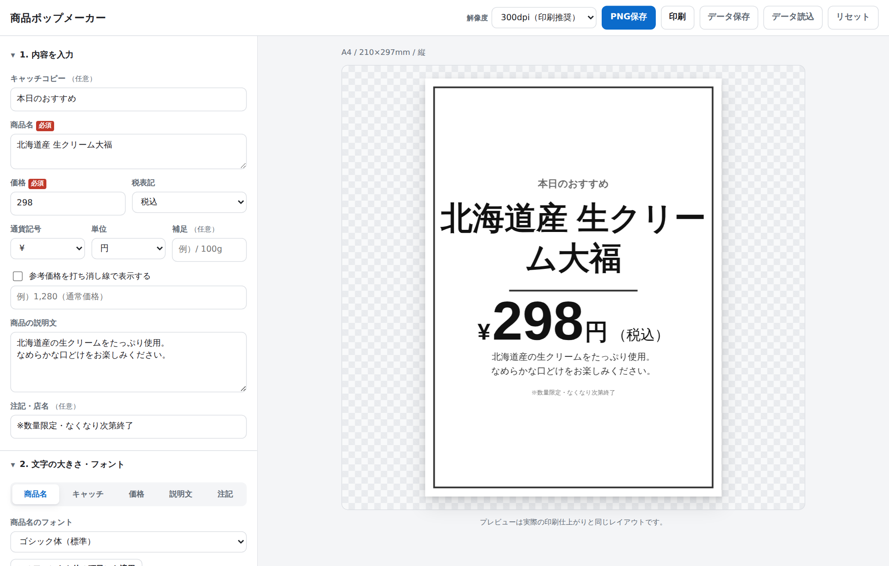

# 商品ポップメーカー

商品名・説明文・価格を入力するだけで、店頭で使える商品ポップ（POP）を作って印刷できる Web ツールです。
インストールもアカウント登録も不要。`index.html` をブラウザで開くだけで動きます。



## できること

### 入力できる情報
| 項目 | 内容 |
| --- | --- |
| 商品名（必須） | 複数行OK。長い名前は自動で折り返します |
| 価格（必須） | 3桁カンマ区切り、通貨記号（¥）、単位（円）、税表記（税込／税抜など） |
| 商品の説明文 | 複数行OK |
| キャッチコピー | 「本日のおすすめ」など、商品名の上に入る一言 |
| 参考価格 | 打ち消し線つきで通常価格を併記（セール表示用） |
| 補足 | 「/ 100g」などの単価表記 |
| 注記・店名 | 「※数量限定」などの小さい文字 |
| バッジ | NEW・おすすめ などのタグ（角丸タグ／リボン／丸印） |

### 文字の調整
- **項目ごと**に フォント・文字サイズ（pt）・太さ（標準／太字／極太）・文字色・行間 を設定
- 日本語フォント12種（ゴシック体・明朝体・丸ゴシック体＋Google Fonts の日本語フォント9種）
- 「このフォントを他の項目にも適用」で一括統一
- 「すべて小さく／大きく」で全体のバランスを保ったままサイズ変更
- **自動縮小**：用紙からはみ出すときは、収まる最大サイズを自動計算

### 商品画像・ロゴ
- 画像を取り込んでポップに配置（**プレビュー上でドラッグ移動・四隅で拡大縮小**）
- 文字の**前面／背面**を切替（写真の上に文字を重ねる／写真を主役に文字を上へ）、透明度・幅(mm)調整
- 取り込み時に自動で軽量化（長辺2000px）。PNG／印刷にもそのまま反映

### レイアウト・デザイン
- 用紙サイズ：**JIS A判（A3〜A8）／JIS B判（B4〜B8）** ＋ はがき／名刺／正方形／短冊／カスタム（mm指定）、縦横切替（B判はJIS寸法。ISO Bとは別）
- 文字揃え（左・中央・右）、縦の配置（上寄せ・中央・上下いっぱい）、余白、要素の間隔、区切り線
- テンプレート6種：シンプル／セール／ポップ／ナチュラル／手書き風／ダーク
- 背景色・アクセント色・枠線（実線／二重線／破線／角丸）・ヘッダー帯

### 出力・保存
- **PNG保存**（150 / 300 / 600 dpi）— 300dpi なら印刷しても文字がにじみません
- **印刷** — 用紙サイズに合わせた原寸で印刷ダイアログを開きます
- **データ保存／読込** — 設定を JSON ファイルで持ち出し・共有
- **名前を付けて保存** — よく使うデザインをブラウザ内に保存（最大30件）
- 編集内容は自動保存され、次に開いたときに復元されます

## 使い方

### そのまま使う
1. このリポジトリをダウンロード（または `git clone`）
2. `index.html` をダブルクリックしてブラウザで開く
3. 左のパネルに入力 → 右のプレビューを見ながら調整 → 「PNG保存」または「印刷」

> Google Fonts の日本語フォント（Noto Sans JP、Dela Gothic One など）を使う場合はインターネット接続が必要です。
> オフラインのときは自動的にお使いのパソコンのフォントで表示されます（レイアウトは崩れません）。

### GitHub Pages で公開する
リポジトリの Settings → Pages で、Source に `main` ブランチのルート（`/`）を指定するだけです。
ビルド作業は必要ありません。

### 印刷のコツ
- プリンタの設定で「拡大縮小なし（実際のサイズ / 100%）」「余白なし」を選ぶと、指定した用紙サイズどおりに刷れます
- 「PNG保存」した画像をコンビニのネットプリントに登録して印刷することもできます

## ファイル構成

```
index.html              画面（操作パネルとプレビュー）
assets/css/style.css    操作画面のスタイル
assets/js/
  fonts.js              フォント定義とWebフォントの読み込み
  text.js               日本語の折り返し（禁則処理）・数値の3桁区切り
  presets.js            用紙サイズ・テンプレート・初期値
  renderer.js           ポップの描画エンジン（プレビューと書き出しで共通）
  storage.js            自動保存・プリセット・ファイル入出力
  app.js                画面の組み立てとイベント処理
```

## 技術的なメモ

- **依存ライブラリなし**（素の HTML / CSS / JavaScript）。ビルド不要で `file://` からも動くよう、ES Modules ではなく通常の `<script>` で読み込んでいます
- **プレビューと書き出しは同じ描画関数**（`renderer.js`）を使い、`pxPerMm` を変えるだけで解像度を切り替えます。そのため画面で見たとおりの結果が印刷されます
- **禁則処理を自前実装**：行頭に `、。」` などが来ない／行末に `「（` などが来ないように折り返します（`text.js`）
- **自動縮小は二分探索**：文字を縮めると折り返し行数も変わるため、比例計算ではなく「用紙に収まる最大の倍率」を探索しています
- 保存は `localStorage`。プライベートブラウジングなどで使えない場合は、その旨を画面に表示します

## 動作環境

Chrome / Edge / Firefox / Safari の最新版（PC・タブレット・スマートフォン）。
